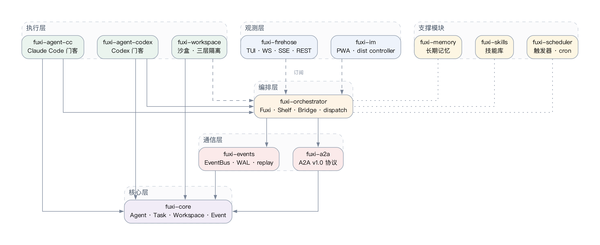

# 系统总体设计

本章在第一章对 AI Agent 协作场景与现有工作的梳理之上，给出 Fuxi 系统的总体设计。论文采用「问题—方案—度量」的展开方式：先界定系统目标与功能/非功能需求，再给出分层架构与模块边界，最后将通信模型与性能指标进行形式化表达，为后续模块设计与实验评估提供统一参照。

## 2.1 系统目标及主要任务

Fuxi 的设计目标不是把多个 Agent 简单串联成对话流水线，而是为多 Agent 协作提供一套稳定、可观测、可恢复的通信与运行时基础设施。系统面向的典型场景是：用户向顶层 Agent 提出较复杂的软件工程或运维需求，顶层 Agent 将需求分解为若干子任务，选择合适角色的工作 Agent 执行，并在执行过程中持续接收状态事件，最终向用户汇报结果。该过程要求系统既能支持 Agent 间的自然语言协作 [@li2023camel] [@wu2023autogen]，也能在工程层面提供严格的事件记录、任务状态与故障边界。

围绕上述目标，系统主要承担如下任务。其一，实现 Agent 与 Agent 之间的标准化任务通信，使任务的创建、派发、状态变化与结果交付具有统一语义 [@a2aproject2025a2a]。其二，实现用户、玄女、门客、IM 端与观测端之间的实时事件传播，所有订阅者无需轮询即可获取最新状态。其三，实现跨进程与跨节点的任务派发，使本地与远端 Worker 在同一 Agent 抽象下被等价调度。其四，实现工作区隔离与交付物管理，防止多个 Agent 在同一目录中相互覆盖。其五，提供长期记忆、角色技能与定时触发等扩展能力，使系统具备超越单次会话的持续运行能力 [@wang2023voyager]。其六，通过完整的测试体系与可观测接口保证系统行为可被验证、可被回放、可被审计。

上述任务共同决定了系统的边界：Fuxi 不重新发明大语言模型，也不替代具体的 Agent CLI，而是为已有 Agent 提供「通信底座 + 编排上下文 + 观测出口」三件套，使 Agent 协作具备工程系统应有的稳定性。

## 2.2 需求分析

### 2.2.1 功能需求

系统的功能需求可归结为如下若干类。第一类是 Agent 与任务的生命周期管理，包括 Agent 注册与注销、Agent 角色加载、任务创建、任务派发、任务取消与任务恢复。第二类是消息与事件传播，包括 Agent 间消息发送、系统事件发布、事件订阅、事件历史回放与抄送通路。第三类是工作区与交付物管理，包括工作区创建、工作区销毁、交付物登记与跨任务的工作区复用。第四类是支撑能力，包括长期记忆查询与写入、角色技能加载、定时触发器、IM 接入与跨节点任务调度。这些功能在第三章中按模块逐一展开。

### 2.2.2 非功能需求

非功能需求决定了系统的性能形态与可用性边界。**低延迟**要求事件从产生到被观测端接收的时间尽可能短，以满足用户对 Agent 工作过程的实时感知；这一指标与公式 (2-1) 给出的端到端延迟分解直接相关。**高吞吐**要求多个 Worker 并发执行时调度损耗可控，避免大量短任务把通信链路本身堵塞。**可恢复**要求系统在 Agent 死亡、节点掉线或服务重启后仍能从事件日志恢复关键上下文，避免协作进程被中断。**可观测**要求用户能够实时看到任务进展、工具调用与异常状态，而不是在任务完成后才看到一段静态结果。**可扩展**要求新加入的 Agent 类型、新的工作区策略或新的通信端点能够通过适配器方式接入，不强迫用户修改核心代码。**本地优先**要求系统的核心数据（事件日志、任务状态、记忆库）默认位于本地存储，云端仅作为可选扩展。

上述非功能需求构成了对架构的约束：高吞吐与低延迟要求事件总线必须具备真实时推送能力，可恢复要求事件流必须可被持久化与回放，可观测要求事件流必须可被多个订阅者并行消费，本地优先要求底层存储不能强依赖外部服务。这些约束直接导出第 2.3 节的分层架构与第 2.4 节的通信模型。

## 2.3 系统整体架构

Fuxi 采用分层架构，将不同职责的模块按依赖方向自下而上排列，使每一层只依赖更下一层提供的稳定接口。系统总体架构如图 2.1 所示。

最底层为**核心层**，由 `fuxi-core` 提供，集中定义 Agent、Task、Workspace、Event 等核心类型。这一层不引入外部 IO，仅描述数据结构与基本 trait，确保上层在演进过程中可保持类型层面的稳定。Wooldridge 在多智能体系统教材中给出的 Agent 定义被作为本层 Agent trait 的概念锚点 [@wooldridge2009mas]，但在工程实现上做了显著简化——本层不约束 Agent 的内部推理机制，只约束其对外暴露的能力描述、任务接收与状态报告接口。

向上一层为**通信层**，由 `fuxi-events` 与 `fuxi-a2a` 共同构成。`fuxi-events` 负责事件的发布、订阅与持久化，是系统真实时推送能力的承载者；`fuxi-a2a` 描述 Agent 间任务、消息与能力发现的协议语义，与开源 A2A 协议规范保持兼容 [@a2aproject2025a2a]。两者职责互补：A2A 关注 Agent 之间「应当传递什么」，事件总线关注「在系统内部已经发生了什么」。这种区分避免了在协议层堆砌过多状态语义，使协议本身保持轻量。

再向上为**编排层**，由 `fuxi-orchestrator` 实现。该层维护系统中所有 Agent 的状态（即 Agent shelf），根据任务需求选择合适的 Worker，并桥接关键系统事件到顶层 Agent 的上下文。编排层的设计借鉴了 MetaGPT 与 ChatDev 中关于角色分工的思想 [@hong2023metagpt]，但相比之下更强调执行层的可观测与任务事件的可追踪，所有调度决策都通过事件总线对外暴露。

执行层由 `fuxi-agent-cc`、`fuxi-agent-codex` 与 `fuxi-workspace` 构成，负责把外部 CLI Agent（如 Claude Code、Codex）封装成统一接口，并为其分配隔离工作树。借鉴 SWE-agent 与 OpenHands 在 Agent-Computer Interface 上的工作 [@yang2024sweagent] [@wang2024openhands]，本层将 Agent 与计算机环境之间的接口抽象为「进程 + 工作区 + 事件流」三元组，使任意 CLI Agent 都可以通过适配器方式接入。

观测层由 `fuxi-firehose`、`fuxi-im` 与终端 TUI 构成，负责将事件流以 WebSocket、SSE、REST 与 PWA 等多种形式呈现给用户 [@fette2011websocket] [@whatwg2024sse]。观测层只读不写，所有逻辑判断都在编排层完成，这一边界使观测端可以被替换或并存而不影响系统正确性。

支撑模块横向贯穿各层，包括 `fuxi-memory`（长期记忆）、`fuxi-skills`（角色与技能）、`fuxi-scheduler`（触发器）等。这些模块通过事件订阅与显式 API 与编排层交互，本身不打破自下而上的依赖方向。

## 2.4 通信模型与性能指标

Fuxi 的通信模型以「事件」为中心。一次用户请求首先被表示为 `UserPrompted` 事件，再由编排层生成 `TaskCreated`；本地任务分配给某个 Agent 后产生 `TaskDispatched`；Agent 执行过程中产生 `ToolCallStarted`、`ToolCallFinished`、`AgentResponded` 等过程事件；任务结束时统一产生 `TaskStateChanged` 事件并进入 `Done` / `Cancelled` / `Failed` 等终态。所有事件一方面通过 broadcast 实时推送给订阅者 [@tokio2024broadcast]，另一方面写入 SQLite WAL 支撑回放 [@sqlite2024wal]。

为了对系统性能进行可度量分析，本文将单次任务的端到端延迟分解为四个分量：

$$L_{e2e} = L_{enq} + L_{disp} + L_{exec} + L_{evt} \tag{2-1}$$

式 (2-1) 中，$L_{e2e}$ 表示从用户提出请求到结果回传的端到端耗时；$L_{enq}$ 表示任务进入派发队列的入队开销；$L_{disp}$ 表示编排层选择 Worker 并发出派发指令的调度开销；$L_{exec}$ 表示 Worker 实际执行任务的耗时（包括模型推理与工具调用）；$L_{evt}$ 表示事件从产生到抵达观测端的传播开销。在大多数实际工作负载中，$L_{exec}$ 由模型推理时间主导，但当任务粒度变细或 Worker 数量增加时，$L_{enq}$、$L_{disp}$ 与 $L_{evt}$ 的相对占比会显著上升，进而影响用户的交互体验。本文第五章对各分量的实测拆解将基于该公式展开。

系统的吞吐定义为单位时间内完成的任务数：

$$T = N / W_{total} \tag{2-2}$$

式 (2-2) 中，$N$ 表示在测量窗口内完成的任务数，$W_{total}$ 表示该窗口的总耗时（wall clock）。对于具有 $K$ 个 Worker、单任务理想耗时为 $\tau$ 的工作负载，理论吞吐上限为 $T_{ideal} = K / \tau$。基于此可定义系统的调度损耗：

$$\eta = 1 - T / T_{ideal} \tag{2-3}$$

式 (2-3) 中的 $\eta$ 反映了通信链路、调度逻辑与同步开销在整体吞吐中的占比。当 $\eta$ 接近零时，系统接近理论上限；当 $\eta$ 显著增大时，意味着通信或调度成为瓶颈。第五章吞吐量实验将以该指标为分析基础，定量评估 Fuxi 在不同 Worker 数量与任务粒度下的工程表现。

公式 (2-1)~(2-3) 共同构成本文对「高性能分布式通讯」中「高性能」一词的可度量定义。后续模块设计与实验设计均围绕降低 $L_{evt}$、控制 $\eta$、保持各分量可分离这三个目标展开。

## 2.5 本章小结

本章从系统目标、功能与非功能需求、整体架构与通信模型四个层面给出了 Fuxi 的总体设计。系统以事件驱动作为核心通信方式，将多 Agent 协作问题转化为任务生命周期与事件流管理问题；通过分层架构使每一层只承担单一职责，避免协议、调度与观测的耦合；通过端到端延迟分解、吞吐与调度损耗的形式化定义，使后续实验评估具有可度量、可比较的基准。第三章将在此基础上，对通信协议、事件总线、编排调度、工作区隔离、观测与记忆等核心模块的设计细节展开论述。
