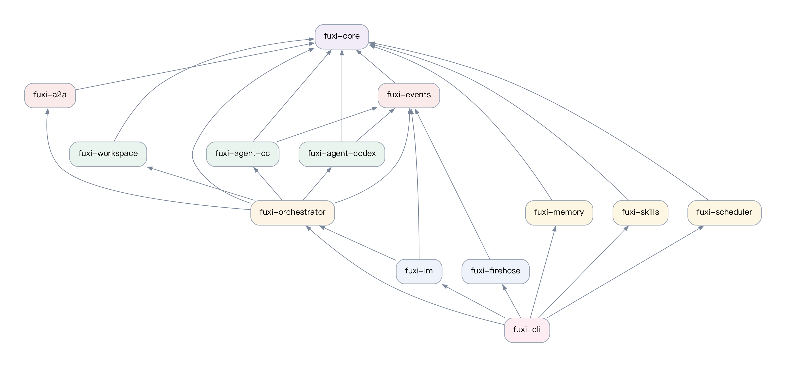
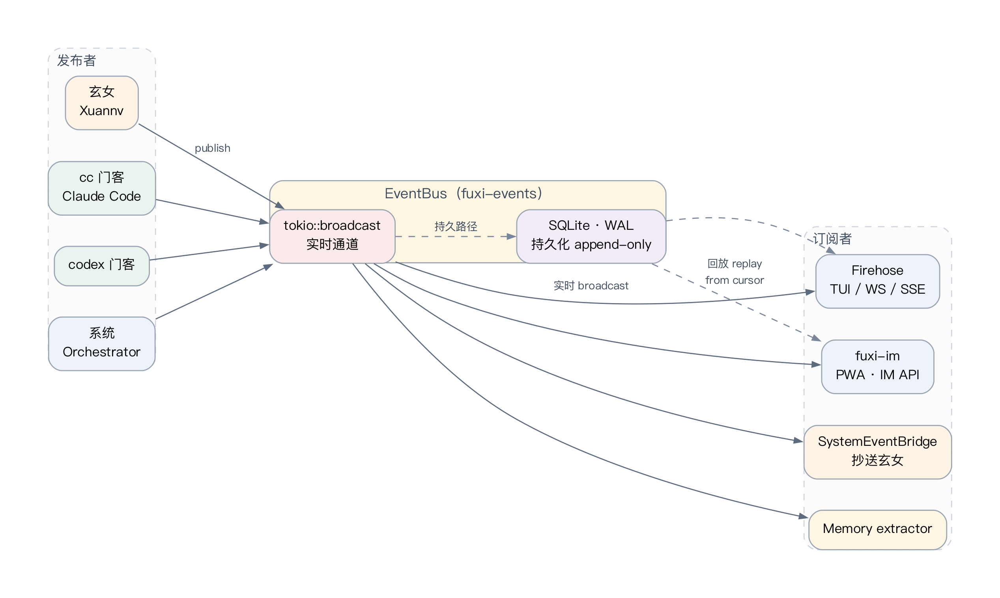
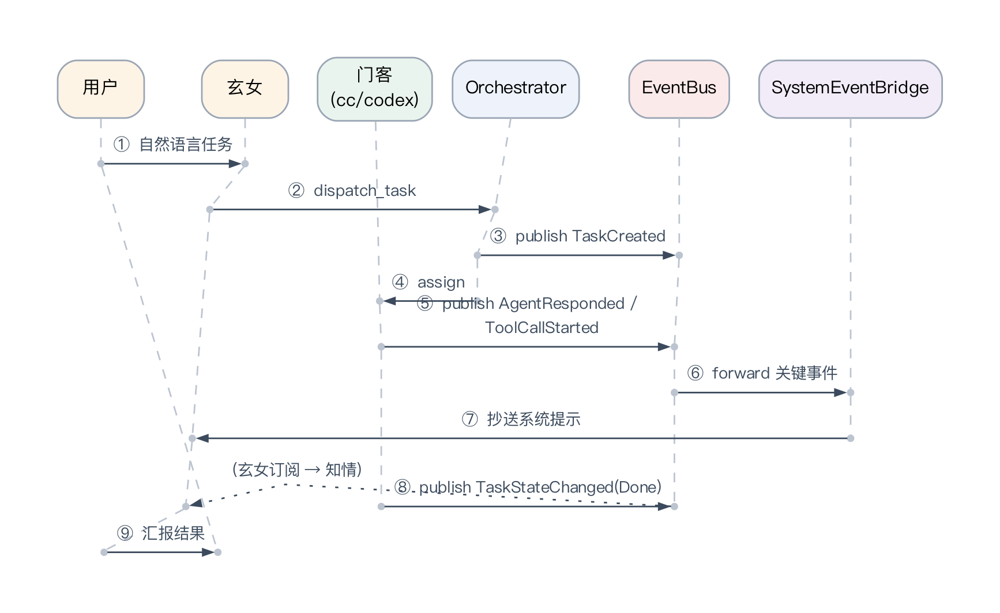
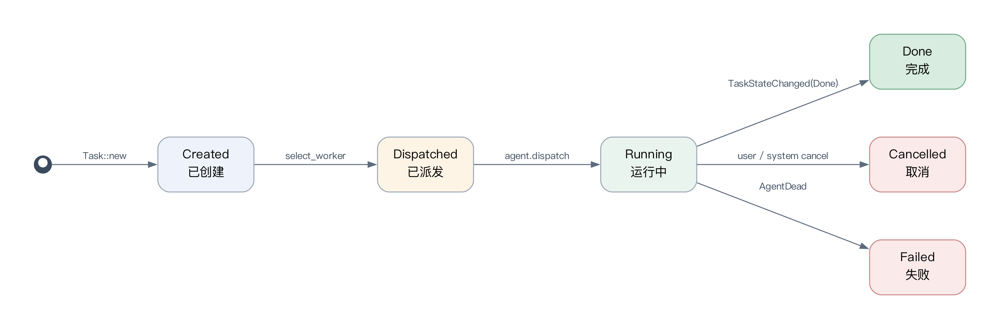
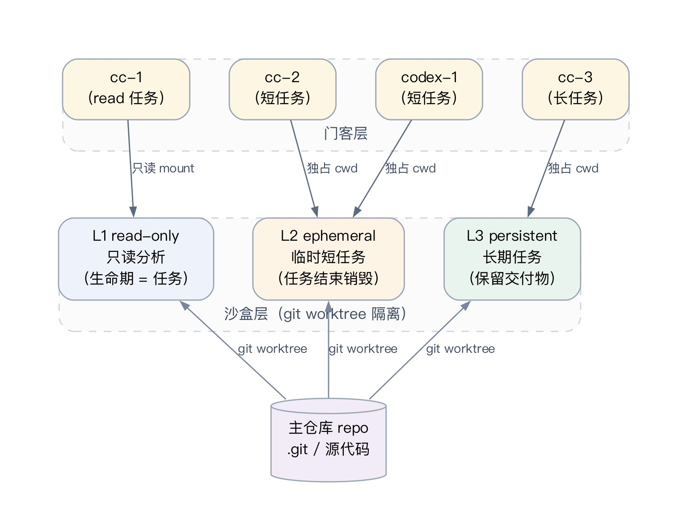

# 系统核心模块设计

第二章给出了 Fuxi 的总体架构与通信模型形式化定义，本章在此基础上对系统的七个核心模块进行设计层面的深入说明。模块划分遵循「核心类型稳定、通信层独立、编排层集中、执行层可替换、观测层多出口」的原则，使各模块边界清晰，互不影响。

## 3.1 模块划分

Fuxi 的模块依赖关系如图 3.1 所示。系统沿核心类型层、通信层、编排层、执行层、观测层与支撑模块自下而上分组，依赖方向严格向下，避免循环依赖造成编译时与运行时的耦合。

具体而言，`fuxi-core` 位于最底层，所有其他 crate 都直接或间接依赖它；`fuxi-events` 与 `fuxi-a2a` 各自依赖 `fuxi-core` 但互不依赖；`fuxi-orchestrator` 同时依赖 `fuxi-events`、`fuxi-a2a` 与 `fuxi-core`，是上层模块的汇聚点；`fuxi-agent-cc`、`fuxi-agent-codex` 与 `fuxi-workspace` 形成执行层；`fuxi-firehose` 与 `fuxi-im` 构成观测层；`fuxi-memory`、`fuxi-skills` 与 `fuxi-scheduler` 作为横向支撑模块通过事件订阅与显式 API 接入。CLI 入口 `fuxi-cli` 位于最上层，统一聚合各 crate 形成可执行二进制。这种分层使得任何一个模块的内部实现都可以在保持对外接口的前提下被替换，例如把 `fuxi-events` 的存储后端从 SQLite 替换为其他嵌入式数据库时，不会波及上层 crate。

下面对每个模块的设计动机、关键接口与设计取舍逐一说明。

## 3.2 Agent 通信协议模块

通信协议模块由 `fuxi-a2a` 提供，负责描述 Agent 之间能够交换的语义对象。Agent 之间的通信本质上是「能力发现 + 任务委派 + 状态报告」三件事的组合：能力发现解决「我能交给你做什么」的问题，任务委派解决「具体把什么任务交给你」的问题，状态报告解决「任务进展如何」的问题。Fuxi 在协议层保留了 Agent2Agent 协议中的 AgentCard、Task、Message 与 Artifact 等核心概念 [@a2aproject2025a2a]，并按本地优先场景进行了轻量化处理：去掉了云端身份联邦相关的字段，简化了任务签名机制，使协议在本地进程间通信时保持低开销。

与 Anthropic 的 Model Context Protocol [@anthropic2024mcp] 相比，A2A 与 MCP 解决的是不同层次的问题。MCP 关注模型与外部工具、数据源之间的连接，更接近于「模型如何调用工具」这一接口规范；A2A 关注 Agent 与 Agent 之间的协作，更接近于「Agent 如何分派任务给另一个 Agent」这一协作规范。Fuxi 同时支持两类协议：内部 Agent 间使用 A2A 协议传递任务与消息；外部工具调用沿用 MCP 兼容的能力声明，从而既能复用工具生态，又能保持 Agent 间协作的语义清晰。

协议模块的另一项关键设计是 Agent 适配器的可替换性。Claude Code、Codex 或未来其他 CLI Agent 都可以被包装成一个统一的 Rust trait `Agent`，只要它能够接收任务、返回消息、报告状态即可。这一设计与 SWE-agent 关于 Agent-Computer Interface 的论述一致 [@yang2024sweagent]——Agent 与外部世界之间的接口是一等公民，应当被显式描述而非隐含在调度逻辑中。Fuxi 的这一选择带来的工程收益是，新增一种 CLI Agent 只需要实现 `Agent` trait 与对应的 stdout 解析器，无需修改协议层、编排层或观测层的任何代码。

需要特别指出的是，A2A 协议描述的是 Agent 间「应当传递什么」，事件总线（§3.3）则描述系统内部「已经发生了什么」。前者是动作语义，后者是事实语义；前者面向 Agent 之间的契约，后者面向系统观察者。这一划分避免了把所有状态都塞进协议字段所导致的协议膨胀，使协议本身保持稳定，而事件类型可以随系统演进自由扩展。

## 3.3 事件总线模块

事件总线由 `fuxi-events` 实现，是系统真实时通信能力的核心。事件总线同时承担三项任务：实时分发、持久化与回放。这三项任务在传统消息系统中往往由不同组件分别承担——Kafka 用追加日志解决持久化与回放 [@kreps2011kafka]，订阅式队列处理实时分发——Fuxi 在本地优先场景下将三者合并到同一个抽象中，以降低工程复杂度。

实时路径基于 Tokio 的 `broadcast` channel [@tokio2024broadcast]。该 channel 的特点是一个发送者发布消息后，多个接收者均可独立接收，适合 Firehose、IM、TUI 与 SystemEventBridge 等多个观察者同时订阅同一事件流。但单纯的内存 channel 无法解决历史回放与崩溃恢复问题，因此 Fuxi 在事件发布的同一原子动作中将事件追加写入 SQLite 数据库，并启用 WAL 模式 [@sqlite2024wal]。SQLite 的 WAL 通过追加日志完成事务提交，读者可以在写入同时继续读取旧版本数据，这与事件溯源模型高度契合：事件是不可变的事实，写入只增不改，读取可在任意时刻发起。

从分布式系统的视角看，事件总线必须保持事件之间的因果序。Lamport 在分布式系统事件排序的经典工作中指出，事件的先后关系是理解分布式行为的基础 [@lamport1978time]。Fuxi 通过事件元信息显式记录 Agent ID、Task ID、时间戳与事件序号，使得系统中每一条事件在被发布之时即获得明确的逻辑顺序。对于跨节点场景，远端节点的事件在回传到 home 节点的事件总线时，仍以 home 节点本地时钟为基准重新排序，确保订阅者看到的事件序列具有线性可读性。

广播事件从产生到抵达所有订阅者的延迟可表示为：

$$L_{evt} \geq \max_i (T_{serialize} + T_{channel} + T_{consume,i}) \tag{3-1}$$

式 (3-1) 中，$T_{serialize}$ 表示事件序列化为可传输形式的耗时，$T_{channel}$ 表示事件经过 broadcast channel 的传播开销，$T_{consume,i}$ 表示第 $i$ 个订阅者从接收到处理完成的耗时。该不等式给出了广播事件延迟的下界——实际延迟取决于最慢订阅者的消费速度。Fuxi 在事件总线层面对慢订阅者采用 lag 检测机制：若某订阅者落后过多，broadcast 会主动跳过部分事件并提示落差，避免单个慢订阅者拖垮整条事件流。该策略与 Kafka 中 consumer lag 的处理逻辑一致，但在内存 channel 上以更轻量的方式实现。

事件总线的另一项关键能力是历史回放。订阅者可以指定从某一事件序号之后开始接收，事件总线会先从 SQLite 中读取历史事件，再无缝切换到实时 channel 的新事件流。这一能力使得 Agent 死亡后重启、UI 刷新或新订阅者上线等场景都能从一致的历史出发继续工作，无需丢失或重复处理事件。事件总线的 publish/subscribe 拓扑如图 3.3 所示。

## 3.4 编排与任务调度模块

编排模块由 `fuxi-orchestrator` 实现，其核心职责是维护系统中所有 Agent 的状态（agent shelf），并根据任务需求选择合适的 Agent 执行。Fuxi 将直接面向用户的顶层 Agent 称为「玄女」，将负责执行具体任务的 worker Agent 称为「门客」，二者通过编排层间接通信，绝不直接调用对方接口。这种分层与 MetaGPT 中关于角色分工的设计思想一致 [@hong2023metagpt]，但 Fuxi 更强调执行层的可观测与任务事件的可追踪——所有调度决策都通过事件总线对外暴露，使整个调度过程对观测端透明。

Worker 选择是编排模块的关键算法。给定任务 $t$，编排层在所有 Agent 中选择满足约束的最低负载者：

$$\text{select}(t) = \arg\min_{w \in W} \{ \text{load}(w) \mid \text{tags}(t) \subseteq \text{tags}(w),\ \text{pin}(t) \in \{\emptyset, w.\text{node}\} \} \tag{3-2}$$

式 (3-2) 中，$W$ 表示当前在线的 Worker 集合，$\text{tags}(t)$ 与 $\text{tags}(w)$ 分别表示任务与 Worker 的能力标签集合，$\text{pin}(t)$ 表示任务对节点的绑定约束（若用户显式 `@<node>` 指定了节点，则只允许该节点的 Worker 接单）。$\text{load}(w)$ 在 Fuxi 当前实现中定义为 $\text{inflight}(w) / \text{max\_concurrency}(w)$，即当前并发占比；该归一化使不同容量的 Worker 在同一标尺下被比较，避免大容量 Worker 被持续偏向。

任务调度分为本地调度与分布式调度两条路径。本地调度直接从 shelf 中选择满足条件的 Agent 并派发任务，整个过程在单进程内完成，延迟最低。分布式调度在任务包含 `pinned_node` 或 `required_tags` 时进入 dist 队列，由目标节点的 dist controller 异步拉取并执行；执行过程中产生的事件通过 dist event 路径回传到 home 节点的事件总线，订阅者无感知任务实际位于本地还是远端。该设计与 MapReduce 将任务分解、调度与故障恢复封装在运行时中的思想一致 [@dean2004mapreduce]，但 Fuxi 的任务粒度更接近于交互式 Agent 工作单元，而非大数据批处理。

为避免顶层 Agent 通过轮询方式查询 Worker 状态，编排层引入了 SystemEventBridge。该桥接器订阅 `AgentDead`、`TriggerFired`、`AgentRequestReview`、`TaskStateChanged` 等关键系统事件，并将其转换为注入玄女上下文的系统提示。这样玄女在保持知情权的同时不需要主动轮询，符合系统的「真实时，不轮询」原则。玄女与门客之间的协作时序如图 3.5 所示。

任务的完整生命周期由状态机描述（图 3.2）：任务从 `Created` 状态开始，经 `Dispatched` 进入 `Running`，最终落到 `Done`、`Cancelled` 或 `Failed` 三个终态之一。每一次状态变化都对应一条 `TaskStateChanged` 事件，使得任意时刻系统都可以从事件流恢复任务的当前状态。

## 3.5 执行适配器与工作区隔离模块

执行适配器负责将外部 CLI Agent 包装成统一的 Rust trait。`fuxi-agent-cc` 适配 Claude Code，`fuxi-agent-codex` 适配 Codex CLI。两个适配器在结构上类似，但策略上有所差异：CC 适配器维持长期会话，借助 stream-json 协议解析模型输出，并支持多轮追加式介入；Codex 适配器采用 lazy spawn 模式，每次任务派发对应一次 `codex exec` 进程的生命周期，使短任务执行后能够立即释放资源。

工作区隔离由 `fuxi-workspace` 提供，利用 Git worktree 在同一仓库下创建多个独立工作树 [@git2024worktree]，从而避免多个 Agent 修改同一目录造成冲突。Fuxi 将工作区划分为三层：L1 read-only 用于只读分析任务，Agent 在此环境中无法写文件；L2 ephemeral 用于临时短任务，工作区随任务结束被销毁；L3 persistent 用于需要保留交付物与跨任务上下文的长期任务。该分层设计如图 3.4 所示。

工作区分层既回应了 SWE-agent 与 OpenHands 对 Agent-Computer Interface 与沙箱执行环境的重视 [@yang2024sweagent] [@wang2024openhands]，也呼应了多 Agent 系统中关于资源隔离的传统讨论 [@stone2000multiagent]。L3 工作区还承担「交付物」语义：任务完成后，编排层将 Agent 在 L3 中产出的关键文件登记为 deliverable，由后续任务通过显式查询接口复用，避免重复执行。

## 3.6 观测与 IM 接入模块

观测模块由 `fuxi-firehose` 与 `fuxi-im` 构成。`fuxi-firehose` 将事件流以四种形式输出：终端 TUI 用于本地开发观测，WebSocket 用于浏览器端实时推送 [@fette2011websocket]，SSE 用于轻量单向推送 [@whatwg2024sse]，REST 用于一次性历史查询。底层 HTTP 与 WebSocket 服务能力由 Axum 框架提供 [@axum2024docs]，Fuxi 在其上仅添加事件订阅、Lag 处理与认证逻辑，避免重复实现网络栈。

`fuxi-im` 提供 PWA 后端、节点视图、任务视图、通知与上传能力，使用户可以在移动端观察 Fuxi 集群状态。所有观测端共用同一事件总线接口，仅在事件呈现层做差异化处理：TUI 偏向密集信息流，PWA 偏向卡片化任务视图，但底层数据来源相同。这一设计使得任意新观测端的接入都可以通过订阅事件总线完成，无需在业务层增加分发逻辑。

观测模块只读不写——所有逻辑判断均在编排层完成，观测端不直接修改系统状态。这一边界使得观测端可以被替换、并存或缩放，而不会影响系统正确性。同时，观测端的失效（如 WebSocket 连接断开）也不会反向影响事件总线的工作，体现了「真实时，不轮询；订阅者失效不影响发布者」的设计原则。

## 3.7 记忆、角色与触发器模块

记忆模块 `fuxi-memory` 提供 oracle\_facts、user\_profile 与 hetu\_patterns 等表，分别用于存储客观事实、用户画像与可复用经验模式。Voyager 在其 skill library 中表明，Agent 的长期能力可以通过可检索、可组合的经验库持续积累 [@wang2023voyager]，Fuxi 借鉴这一思想，将经验的存储与查询统一抽象为本地 SQLite 表与显式查询接口，避免引入向量数据库等额外依赖。记忆抽取默认关闭，需要显式开启——这是基于隐私与稳定性的保守选择，避免长时间运行后记忆库被低质量推断填满。

角色模块 `fuxi-skills` 负责加载 ROLE.md 与相关指令文件，使不同 Agent 在启动时具备稳定的职责边界与行为风格。角色加载发生在 Agent spawn 之前，被作为初始系统提示注入；运行过程中可以热加载新角色，但不影响当前正在执行的任务。

触发器模块 `fuxi-scheduler` 支持四种触发条件：cron 周期触发、once 一次性触发、fs-watch 文件系统监听触发，以及 webhook HTTP 触发。所有触发条件被统一映射为 `TriggerFired` 事件，由编排层根据事件内容决定派发哪个 Agent 处理。触发器与编排层通过事件总线解耦，新增一种触发条件只需增加触发源代码，无需修改编排逻辑。

## 3.8 本章小结

本章对 Fuxi 的七个核心模块进行了设计层面的说明。系统以通信协议与事件总线为中心，通过编排层组织 Agent 的状态与调度，通过执行层隔离任务的运行环境，通过观测层暴露系统的实时状态，通过记忆、角色与触发器三个支撑模块支撑长期运行能力。模块之间的依赖严格自下而上，每个模块都具有明确的对外接口与可替换的内部实现，使系统能够在保持核心稳定的同时持续演进。第四章将基于本章的设计，结合 Rust workspace 的具体组织方式，对核心数据结构与关键流程的实现细节给出说明。
