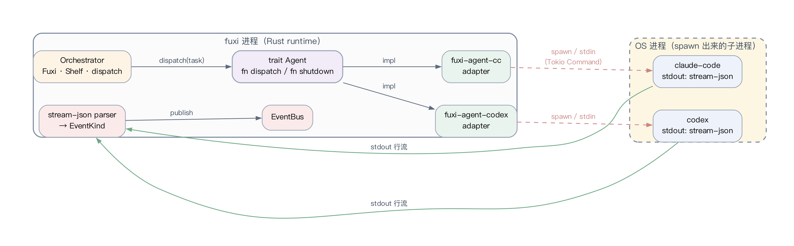
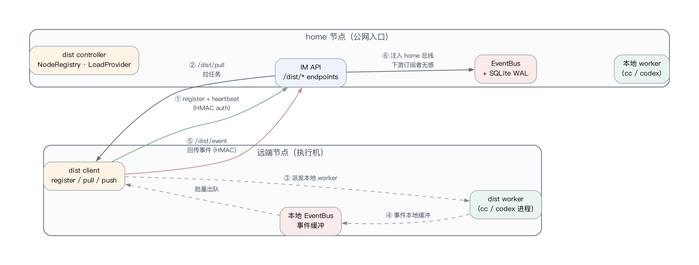

# 系统实现

第三章对核心模块的设计进行了说明，本章在此基础上结合 Fuxi 代码仓库的实际组织方式，对开发环境、Rust workspace 结构、事件数据结构、任务派发流程与分布式通信实现等方面给出说明，并附上关键流程的伪代码。本章描述以仓库 `/Users/e0_7/fuxi` 当前主分支代码为依据。

## 4.1 开发环境与技术选型

Fuxi 选择 Rust 作为主要实现语言，原因主要有三方面。其一，Rust 兼具高性能与内存安全，适合构建长时间运行的本地服务与高并发通信系统，避免了 GC 暂停带来的尾部延迟问题。其二，Rust 的所有权与生命周期模型在编译时强制约束跨线程共享数据的方式，使事件总线与 Agent shelf 等共享状态在并发访问时具备形式化保障。其三，Rust 的异步生态（特别是 Tokio 运行时与 Axum 框架）已经具备工业级成熟度 [@tokio2024broadcast] [@axum2024docs]，可直接用于构建网络服务、后台任务与跨进程通信，避免重复造轮子。

异步运行时选择 Tokio 多线程版本，理由是 Fuxi 内部存在大量并发的事件订阅、任务派发、HTTP 处理与子进程读写，多线程运行时可以充分利用现代多核 CPU。Web 服务使用 Axum，原因是其构建在 hyper 之上、对中间件与路由有良好的支持，且原生提供 WebSocket 与 SSE 能力。持久化存储使用 SQLite，理由是 Fuxi 强调本地优先，SQLite 作为嵌入式数据库无需外部服务，且 WAL 模式与事件溯源模型契合 [@sqlite2024wal]。前端 IM 部分采用 PWA 形态，移动端可直接安装到主屏幕，避免应用商店分发链路。

## 4.2 Rust Workspace 结构

Fuxi 以 Cargo workspace 组织多个 crate，使通信、编排、执行、存储与界面模块相互解耦。Workspace 中各主要 crate 与职责如表 4.1 所示。

| Crate | 主要职责 | 所属层次 |
|---|---|---|
| fuxi-core | 核心 trait、Agent / Task / Workspace / Event 类型 | 全局基础类型 |
| fuxi-events | EventBus、SQLite WAL、事件回放 | 通信核心 |
| fuxi-a2a | A2A wire、JSON-RPC、server / client | Agent 间协议 |
| fuxi-orchestrator | Fuxi 入口、Shelf、Bridge、dispatch | 任务编排 |
| fuxi-agent-cc | Claude Code CLI Agent 适配 | 执行适配 |
| fuxi-agent-codex | Codex CLI Agent 适配 | 执行适配 |
| fuxi-workspace | Git worktree 与 sandbox 管理 | 执行隔离 |
| fuxi-firehose | TUI、WebSocket、SSE、REST 输出 | 实时观测 |
| fuxi-im | IM API、PWA 后端、dist controller | 移动端与分布式入口 |
| fuxi-memory | Oracle、Hetu pattern、抽取器 | 长期记忆 |
| fuxi-skills | 角色加载、技能仓库 | 角色支撑 |
| fuxi-scheduler | cron / once / fs / webhook 触发器 | 主动触发 |
| fuxi-cli | 二进制入口 | CLI 集成 |

表 4.1 Fuxi workspace 主要 crate 与职责

每个 crate 均使用 `[lib]` 形式输出独立库，仅 `fuxi-cli` 同时输出可执行二进制。Cargo workspace 的统一依赖管理使得 Tokio、serde、anyhow 等通用依赖在所有 crate 中保持版本一致，避免符号冲突。代码风格由 `cargo fmt` 强制统一，质量由 `cargo clippy --workspace --all-targets -- -D warnings` 作为 CI 门禁，保证所有合入主干的代码均通过 lint。

## 4.3 事件数据结构实现

事件由 `Event` 结构表示，其 `meta` 字段为 `EventMeta`，记录事件 ID、时间戳、Agent ID、Task ID 与 source\_node\_id 等元信息；`kind` 字段为 `EventKind` 枚举，使用 Rust 的标签联合（`#[serde(tag = "type")]`）表示具体事件类型，包括 `AgentReady`、`TaskCreated`、`TaskDispatched`、`TaskStateChanged`、`AgentResponded`、`ToolCallStarted`、`ToolCallFinished`、`TriggerFired`、`AgentDead`、`WorkerRegistered`、`WorkspaceCreated`、`DeliverableProduced` 等。使用枚举的好处是，编译器在 `match` 时强制覆盖所有分支，使新增一种事件后，UI 渲染、持久化与统计逻辑都被强制更新，减少遗漏。

事件写入流程分为三步。首先，业务模块通过 `EventBus::publish(event)` 提交事件；其次，事件总线将事件序列化后写入 SQLite WAL 日志（写入失败会重试有限次数，超出后向调用者返回错误）；最后，事件被克隆到 Tokio broadcast channel，由所有订阅者各自接收。在多生产者并发场景下，broadcast 的内部锁保证发布顺序与接收顺序一致，使得任意订阅者看到的事件流具有线性可读性。

事件之间的因果序通过 Lamport 时间戳维持。给定本地事件 $a$ 与从其他源接收到的事件 $b$，本地逻辑时钟 $C$ 按如下方式更新：

$$\begin{aligned} C(a) &= C_{\text{local}} + 1, \quad \text{当 } a \text{ 是本地新事件} \\ C(\text{recv}(m)) &= \max(C_{\text{local}}, C(m)) + 1, \quad \text{当接收到外部事件 } m \end{aligned} \tag{4-1}$$

式 (4-1) 是 Lamport 在分布式系统事件排序工作中给出的逻辑时钟更新规则 [@lamport1978time]。Fuxi 在 `EventMeta` 中维护此逻辑时钟，跨节点事件回传时按此规则更新本地时钟，使所有节点对同一事件序列具有一致的因果排序。这一性质对调试、审计与 UI 渲染都至关重要，因为它使任意时刻发起的回放都能产生确定的事件顺序。

若某订阅者处理速度落后，broadcast 的 lag 检测机制会通过 `RecvError::Lagged(n)` 提示订阅端发生了 $n$ 条事件的丢帧，订阅端可以选择继续接收新事件并跳过中间空缺，或从 SQLite 持久日志中按序号重读补齐。这一双路径设计使得实时性与完整性可以在不同订阅者上各取所需。

## 4.4 任务派发流程实现

当用户输入任务后，玄女判断任务类型并调用编排层入口。编排层创建 `Task` 实例，写入 `TaskCreated` 事件，然后根据任务的 role、required\_tags、pinned\_node 与 project\_id 等属性选择 Worker。如果任务显式指定 pinned\_node 或 required\_tags 非空，系统经由 dist enqueuer 进入分布式队列；如果任务关联 project\_id 且未显式 pin，编排层根据项目 host\_nodes 与节点负载自动选择最闲节点并写入 pinned\_node；否则走本地 worker 路径。任务执行期间，Agent adapter 从外部 CLI 的输出流中解析消息和工具调用，再转为标准 EventKind 写入事件总线。Agent adapter 与外部 CLI 进程的边界如图 4.2 所示。



为避免顶层 Agent 通过轮询方式查询 Worker 状态，Fuxi 引入了 `SystemEventBridge`。该桥接器订阅 `AgentDead`、`TriggerFired`、`AgentRequestReview`、`TaskStateChanged` 等关键系统事件，将其转换为系统提示注入玄女上下文。这种设计使玄女拥有知情权但不需要主动轮询，符合系统的「真实时，不轮询」原则。

任务派发流程的伪代码如下所示：

```text
Input: user_prompt
task = create_task(user_prompt)                      # 生成 Task 实例
publish(TaskCreated(task))                           # 事件总线广播创建事件
worker = select_worker(task.role, task.tags,
                      task.pinned_node)              # 公式 (3-2) Worker 选择
if worker is remote:
    enqueue_dist_task(task, worker.node)             # 走分布式队列
else:
    publish(TaskDispatched(task, worker))
    worker.dispatch(task)                            # 进程内派发
while task not finished:
    event = read_agent_stream(worker)                # 解析 stdout 流
    publish(event)                                   # 转 EventKind 入总线
publish(TaskStateChanged(task, Done))
```

伪代码的 `select_worker` 步对应公式 (3-2) 的 worker 选择函数，`read_agent_stream` 步对应 Agent adapter 的 stream-json 解析。整个流程不轮询、不阻塞、所有状态变化均通过事件总线对外暴露。

## 4.5 分布式通信实现

分布式通信主要服务于多节点 Worker 场景。IM 启动时内嵌 dist controller，`/api/*` 端点使用 IM cookie 认证，`/dist/*` 端点使用 HMAC 签名认证（共享密钥在 home 与 worker 节点间一次性配置）。home 节点会自动注册并启动一个 embedded dist worker 消费 `pinned_node=home` 的任务；其他节点通过 `/dist/register` 与定期 heartbeat 上报 tags、max\_concurrency 与 inflight 状态。任务拉取时，worker 必须同时满足三个条件：未被 pin 或 pin 到本节点、required\_tags 是 worker.tags 的子集、当前并发未超过 max\_concurrency。远端 worker 完成任务后，将事件回传到 home 节点的事件总线，使得用户在同一 Firehose 中观察本地与远端任务，无感知任务实际执行位置。跨节点任务流如图 4.1 所示。



分布式通信的关键流程伪代码如下：

```text
# Worker 端 register + heartbeat
register(node_id, tags, max_concurrency, hmac)        # 一次性注册
loop:
    sleep(heartbeat_interval)
    heartbeat(node_id, inflight, hmac)                # 定期上报负载

# Worker 端拉任务
loop:
    task = pull(node_id, tags, hmac)                  # home 端按公式 (3-2)
    if task is None: continue                         # 选 worker，无任务返空
    workspace = create_sandbox(task.workspace_layer)
    agent = spawn_agent(task.role, workspace)
    for event in agent.run(task):
        post_event(event, hmac)                       # 回传 home 事件总线
    cleanup_sandbox(workspace)
```

需要说明的是，本实现没有采用强一致复制——Fuxi 当前阶段的分布式范围被限定为任务队列、节点心跳、inflight 回收与事件回传。这一选择降低了实现复杂度，也符合系统的目标规模：Fuxi 面向个人或小团队的本地优先 Agent 协作，而非大规模数据中心服务。对于需要更高一致性的场景，后续可以借鉴 Raft 等一致性算法 [@ongaro2014raft] 与 Spanner、ZooKeeper 等系统在协调服务上的工程经验 [@corbett2012spanner] [@hunt2010zookeeper]。在当前阶段，事件回传链路保证了订阅者能看到完整的事件序列，inflight 回收机制保证了 Worker 掉线后任务不会永远悬挂，这两个性质共同满足了系统目标场景下的可用性要求。

## 4.6 关键流程伪代码

除了任务派发与分布式通信，事件订阅与历史回放也具有相同的「事件流 + 状态机」结构。订阅者从总线获取事件流的伪代码如下：

```text
# 实时订阅
stream = bus.subscribe()
while True:
    event = stream.next()                             # broadcast 通道接收
    handle(event)

# 带历史回放的订阅
cursor = load_cursor()                                # 上次处理到哪
events = bus.replay(from_cursor=cursor)               # 从 SQLite 读历史
for event in events:
    handle(event)
    save_cursor(event.id)
stream = bus.subscribe()                              # 切到实时流
while True:
    event = stream.next()
    handle(event)
    save_cursor(event.id)
```

工作区生命周期的伪代码体现了 Git worktree 与 sandbox 分层的协同：

```text
# 创建 L3 持久工作区
ws = workspace.create(layer=L3, project=task.project_id)
git.worktree_add(ws.path, ws.branch)
# Agent 执行
agent.work(ws.path)
# 任务完成
deliverables = workspace.collect_deliverables(ws)
publish(DeliverableProduced(task.id, deliverables))
# 工作区保留以供后续任务复用
```

上述两段伪代码与 §4.4 的任务派发、§4.5 的分布式通信构成 Fuxi 运行时的四条主要数据流：用户请求流、事件订阅流、跨节点任务流与工作区生命周期流。

## 4.7 本章小结

本章说明了 Fuxi 的工程实现方式。系统通过 Rust workspace 保持模块边界、通过 EventKind 枚举统一事件词汇、通过 Agent adapter 兼容不同 CLI Agent、通过 SystemEventBridge 避免轮询、通过 dist controller 支持跨节点任务执行、通过 Lamport 时间戳保持事件因果序。这些实现细节共同支撑了第三章设计层面给出的模块边界与通信模型。第五章将基于本章实现的代码，对系统进行多维度的测试与性能评估。
