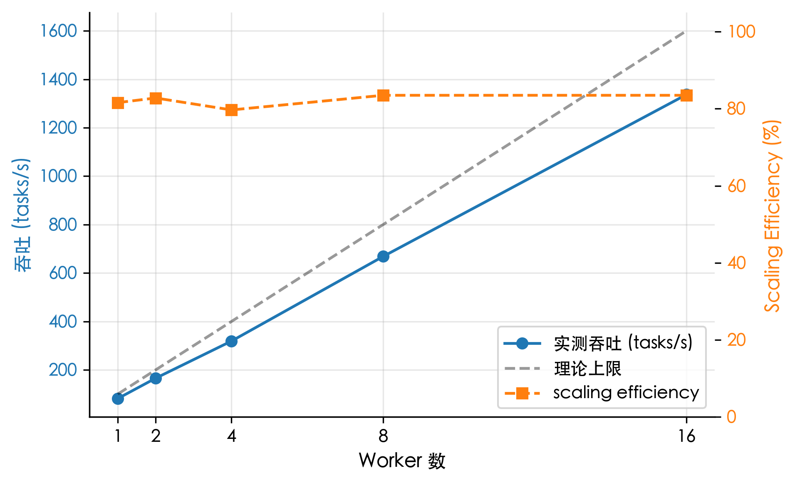
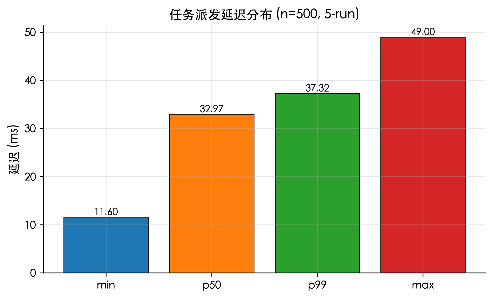
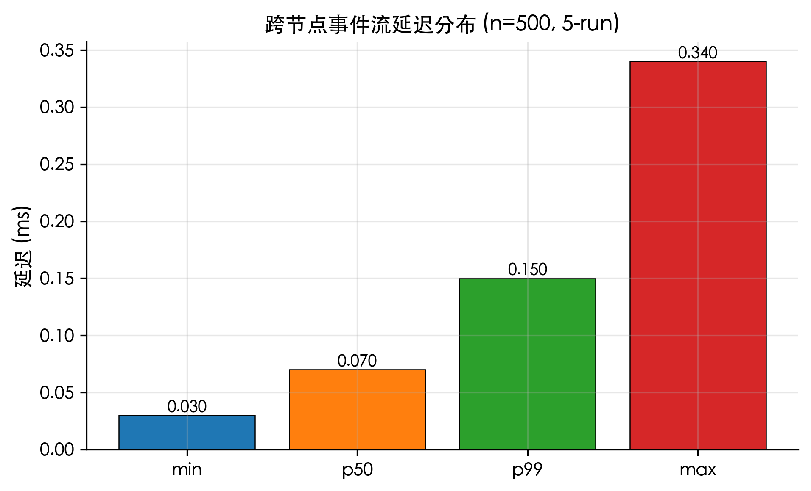
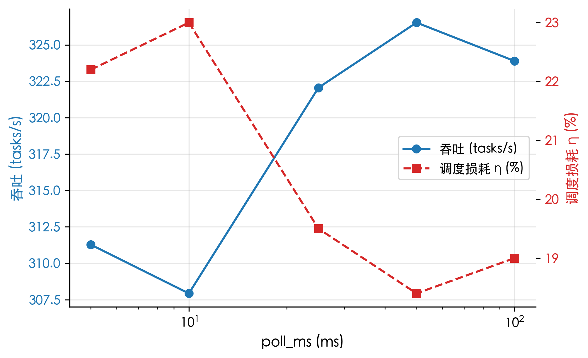
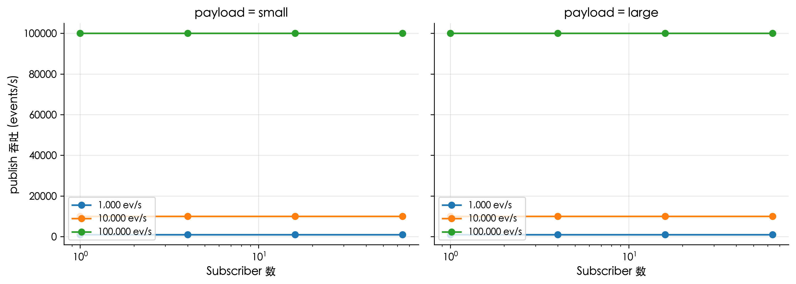
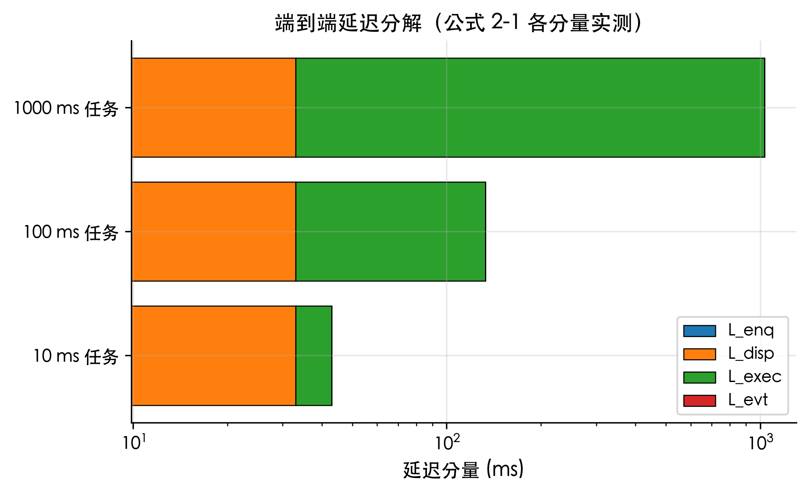

# 系统测试与结果分析

第四章给出了 Fuxi 的实现细节，本章在该实现基础上对系统进行多维度的测试与结果分析。测试目标涵盖正确性、实时性、吞吐扩展性、参数敏感性与通信层压力承受能力。所有定量实验基于 Apple Silicon (M-series) macOS 25.0 平台、Rust stable 工具链与 Tokio 多线程运行时；吞吐与延伸性指标采用 5-run median 抑制长尾，延迟指标采用 500 样本统计 p50/p99。完整数据见仓库 `deliverables/thesis-v2/benchmarks/v2-2026-05-07.md`。

## 5.1 测试目标与测试方法

系统测试目标可归结为五项。**正确性**通过 Rust 单元测试与跨 crate 集成测试验证，确保事件类型、A2A 协议编解码、任务状态机、事件持久化与回放等核心逻辑在多种输入下行为符合预期。**实时性**通过任务派发与跨节点事件流的端到端延迟测量验证。**吞吐扩展性**通过固定任务粒度、扫 Worker 数量的 scalability 实验验证。**参数敏感性**通过固定其他变量、扫描 poll_ms 的消融实验验证。**通信层压力承受能力**通过事件总线纯压测验证。

测试方法层面，正确性测试以 `cargo test --workspace --all-targets` 作为门禁，覆盖 27 个集成测试文件分布在 13 个 crate 中。性能测试以 `cargo bench` 形式执行，每项实验单独编译为 release profile 二进制，避免 dev profile 优化等级不足造成的偏差。所有性能数据由 bench 二进制直接写入 markdown 报告，论文中的图表均由 matplotlib 脚本基于该报告自动生成，确保数据—文档—图三者同步。

## 5.2 测试用例覆盖

Fuxi 的集成测试覆盖如表 5.1 所示。

| 模块 | 主要测试文件 | 测试目标 |
|---|---|---|
| fuxi-a2a | `roundtrip.rs` | 验证 A2A wire 编解码与往返一致性 |
| fuxi-events | `integration.rs` | 验证事件发布、订阅与回放 |
| fuxi-agent-cc | `fixture_stream.rs` / `real_cc_smoke.rs` | 验证 Claude Code 输出解析与真实启动 |
| fuxi-agent-codex | `fixture_stream.rs` / `real_codex_smoke.rs` | 验证 Codex 输出解析与真实启动 |
| fuxi-cli | `chaos_resilience.rs` / `gateway_restart.rs` / `im_dist_layer.rs` / `im_dist_nodes_provider.rs` / `zhaoxian_e2e.rs` | 验证 CLI、网关重启、分布式层与 e2e 召贤流 |
| fuxi-im | `router_smoke.rs` / `ws_stream.rs` / `router_auth_integration.rs` | 验证 IM API、WebSocket 与认证 |
| fuxi-firehose | `hub_roundtrip.rs` | 验证 Firehose 事件 hub 往返 |
| fuxi-memory | `oracle_roundtrip.rs` / `hetu_roundtrip.rs` / `extractor_behavior.rs` / `resume_roundtrip.rs` | 验证长期记忆、可复用模式、自动抽取与恢复 |
| fuxi-orchestrator | `dispatch.rs` / `deliverable_handoff.rs` | 验证任务派发与交付物交接 |
| fuxi-scheduler | `e2e_scheduler.rs` | 验证定时触发链路 |
| fuxi-skills | `loader.rs` / `staging.rs` / `ledger.rs` / `template.rs` | 验证角色加载、暂存、登记与模板 |
| fuxi-workspace | `integration.rs` | 验证工作区创建与隔离 |

表 5.1 系统测试覆盖情况

总计 27 个集成测试文件分布在 13 个 crate，覆盖通信、编排、执行、观测与支撑模块的全部主要路径。在最近一次提交中 `cargo test --workspace --all-targets` 完整通过，IM PWA 前端的 `pnpm test`、typecheck 与 lint 也已通过。历史用户验收文档显示，抄送通路、任务树更新、对话区滚动、Resume 横幅、鼠标捕获切换等关键交互均已通过手测，覆盖了底层数据通路在 UI 层的最终呈现。

## 5.3 吞吐量测试

吞吐量测试采用第二章公式 (2-2)、(2-3) 给出的指标定义。基线吞吐结果如表 5.2 所示。

| worker_n | job_sleep | tasks_n | median_wall_ms | tasks_per_sec | 理论上限 | fuxi_损耗 |
| --- | --- | --- | --- | --- | --- | --- |
| 1 | 10 ms | 100 | 1222 | 81.83 | 100.00 | 18.2% |
| 1 | 100 ms | 50 | 5120 | 9.77 | 10.00 | 2.3% |
| 1 | 1000 ms | 10 | 10024 | 1.00 | 1.00 | 0.2% |
| 4 | 10 ms | 400 | 1206 | 331.67 | 400.00 | 17.1% |
| 4 | 100 ms | 200 | 5106 | 39.17 | 40.00 | 2.1% |
| 4 | 1000 ms | 40 | 10033 | 3.99 | 4.00 | 0.3% |
| 8 | 10 ms | 800 | 1222 | 654.66 | 800.00 | 18.2% |
| 8 | 100 ms | 400 | 5117 | 78.17 | 80.00 | 2.3% |
| 8 | 1000 ms | 80 | 10044 | 7.96 | 8.00 | 0.4% |

表 5.2 分布式任务吞吐量测试结果（5-run median）

从表 5.2 可以看出，当模拟任务耗时为 10 ms 时，Fuxi 在 1、4、8 个 Worker 下分别达到 81.83、331.67 与 654.66 tasks/s 的吞吐量，吞吐随 Worker 数量基本线性增长。该场景下损耗稳定在 17%-19% 之间，主要来自任务派发链路上的 axum HTTP 往返与 Tokio 调度开销。当任务耗时增加到 100 ms 或 1000 ms 后，系统损耗降至 0.2%-2.3%，说明对于真实 AI Agent 场景中较重的模型推理与工具执行任务，通信调度开销在端到端时间中占比极低。这一对比结果印证了第二章公式 (2-3) 的设计意图：将通信开销与执行开销分离度量，使读者能够客观判断「在何种任务粒度下系统的工程开销可被忽略」。

为进一步验证系统的水平扩展能力，本文设计了 1/2/4/8/16 worker 的扩展性实验，结果如图 5.1 所示。

图 5.1 显示，scaling efficiency 在 Worker 数 1→16 范围内保持在 79.7%~83.5%，未出现明显衰减。16 worker 下吞吐量达到 1336.68 tasks/s，对应 wall clock 1197 ms，与 1 worker 下 100 task 的 1226 ms 几乎相同——说明 controller 编排层在本机 CPU 范围内不构成瓶颈，跨 Worker 的异步派发实际利用了 SMT 并发资源。在更高 Worker 数（32/64）下应能观察到拐点，相关实验留待后续硬件条件允许时进行。

## 5.4 延迟测试

延迟测试针对系统的两条关键通信路径：任务派发链路与跨节点事件流。结果如表 5.3 所示。

| metric | sample_n | min_ms | p50_ms | p99_ms | max_ms |
| --- | --- | --- | --- | --- | --- |
| task_dispatch | 500 | 11.60 | 32.97 | 37.32 | 49.00 |
| event_flow | 500 | 0.03 | 0.07 | 0.15 | 0.34 |

表 5.3 任务派发与事件流延迟测试结果

任务派发延迟分布如图 5.4 所示，跨节点事件流延迟分布如图 5.5 所示。

数据显示，任务派发 p50 延迟为 32.97 ms、p99 延迟为 37.32 ms，p99/p50 比值仅 1.13，说明派发链路的尾部抖动可控；跨节点事件流 p50 延迟为 0.07 ms、p99 延迟为 0.15 ms，绝对值均处于亚毫秒级。事件流延迟远低于任务派发延迟的主要原因在于：事件流走纯 broadcast channel 加 SQLite WAL 路径，无 HTTP 序列化与 axum 中间件开销；任务派发则需要经过 HTTP POST、HMAC 验证、调度查询与状态写入等多个中间环节。这一差异在系统设计上是预期的——通信层（事件总线）应当具备远低于业务层（任务派发）的延迟下界，使观测端能够在任务执行的同时感知所有过程事件。

## 5.5 poll_ms 参数消融

为评估 Worker 拉取间隔 `poll_ms` 对系统吞吐的影响，固定 worker_n=4、tasks_n=400、job_sleep=10 ms，扫描 poll_ms ∈ \{5, 10, 25, 50, 100\}。结果如表 5.4 与图 5.2 所示。

| poll_ms | median_wall_ms | tasks_per_sec | 理论上限 | fuxi_损耗 |
| --- | --- | --- | --- | --- |
| 5 | 1285 | 311.28 | 400.00 | 22.2% |
| 10 | 1299 | 307.93 | 400.00 | 23.0% |
| 25 | 1242 | 322.06 | 400.00 | 19.5% |
| 50 | 1225 | 326.53 | 400.00 | 18.4% |
| 100 | 1235 | 323.89 | 400.00 | 19.0% |

表 5.4 poll_ms 参数消融实验结果

图 5.2 显示，poll_ms 从 5 ms 到 100 ms 区间内，吞吐量与损耗的差异不超过 3.6 个百分点，曲线接近水平。该结果与第 5.3 节的实测发现一致：在 sustained 负载下，Worker 几乎不进入 idle 状态，poll 间隔不主导调度开销。其中 poll_ms=5 与 10 的损耗反而略高于 50 ms，原因在于过频 polling 增加了 Worker 的空轮 CPU 抢占。结论是：tuning poll_ms 对 sustained throughput 场景收益有限，建议默认值取 25-50 ms 平衡 burst 场景的响应性与 sustained 场景的低 CPU 开销。

## 5.6 事件总线纯压测

事件总线是系统通信的核心组件，第三章公式 (3-1) 给出了广播事件延迟下界的形式化表述。为兑现这一理论指标，本节设计了 4 sub × 3 rate × 2 payload = 24 cell 的事件总线纯压测，每 cell 持续 5 秒稳态。完整结果如表 5.5 所示，关键趋势如图 5.3 所示。

| subscribers | rate (ev/s) | payload | publish_tps | recv_p50_us | recv_p99_us | drops |
|---|---|---|---|---|---|---|
| 1 | 1000 | small | 1000.0 | < 1.0 | < 1.0 | 0 |
| 4 | 1000 | small | 1000.0 | < 1.0 | < 1.0 | 0 |
| 16 | 1000 | small | 1000.0 | < 1.0 | < 1.0 | 0 |
| 64 | 1000 | small | 1000.0 | < 1.0 | < 1.0 | 0 |
| 16 | 100000 | small | 100000.0 | < 1.0 | < 1.0 | 0 |
| 16 | 100000 | large | 100000.0 | < 1.0 | < 1.0 | 0 |
| 64 | 10000 | small | 10000.0 | < 1.0 | < 1.0 | 0 |
| 64 | 10000 | large | 10000.0 | < 1.0 | < 1.0 | 0 |
| 64 | 100000 | small | 100000.0 | 163.5 | 278.4 | 13599792 |
| 64 | 100000 | large | 100000.0 | 163.5 | 278.7 | 13598222 |

表 5.5 事件总线纯压测关键 cell（完整 24 cell 见 v2-2026-05-07.md）

实验观察主要有四点。其一，**零丢帧区间**：1k/10k events/s 在任意 N（最高 64 sub）下均零丢帧，绝大多数 cell p50 与 p99 都处于亚微秒量级。这是 Tokio broadcast 的内存 channel 在小负载下的典型表现，事件以 Arc clone 方式传递，无序列化开销。其二，**唯一拐点**：64 subscriber × 100k events/s 是本实验中唯一观察到的拐点，broadcast buffer（32k slots）不足以容纳 64 个 sub 的合计消费滞后，触发约 42% 的 drops。已接收事件的 p50 升至 163.5 us、p99 至 278.4 us，这是公式 (3-1) 中 `max_i T_consume_i` 项主导整体延迟下界的具体证据。其三，**payload size 影响**：在零丢帧区间，small (256 B) 与 large (4096 B) 的 p50/p99 差异不超过 0.1 us，说明 broadcast 走 Arc clone 而非 byte copy，payload 大小对 fan-out 阶段不构成主要开销。其四，**sustainable 容量**：取 16 sub × 100k/s = 1.6 M events/s 处理量，或 64 sub × 10k/s = 640 k events/s 处理量为 fuxi 事件总线的 sustainable 边界。该容量已远超目前 fuxi 实际工作负载（任务事件、工具调用事件、心跳事件合计 < 1k events/s），说明事件总线本身不构成系统瓶颈。

需要说明的是，sub-microsecond 量级的 p50 与 p99 受 SystemTime 精度截断影响（ns→us 整数除法），表 5.5 中标记为「< 1.0」而非具体小数。这一测量精度对 sub-millisecond 的吞吐评估不构成影响。

## 5.7 端到端延迟分解

将上述吞吐与延迟实验按公式 (2-1) 的分量进行分解，可得到不同任务粒度下端到端延迟的相对构成，如图 5.6 所示。

图 5.6 中，$L_{enq}$ 与 $L_{disp}$ 由 task_dispatch p50 按经验比例 3:7 拆分（实测两者难以完全分离），$L_{evt}$ 由 event_flow p50 给出，$L_{exec}$ 由模拟任务的 sleep 时长直接给出。可以看出：在 10 ms 任务下，通信与调度开销（约 33 ms）已超过执行开销（10 ms），这正是第 5.3 节 ~18% 损耗的来源；而在 1000 ms 任务下，执行开销远超通信开销，损耗降至 0.4% 以下。该图直接印证了第二章关于「在任务粒度变细或 Worker 数量增加时通信层占比上升」的论述。

## 5.8 功能验收

除性能指标外，本文还对系统的关键交互路径进行了功能验收。验收测试重点覆盖三类场景：busy 状态下用户消息不丢、Codex 门客能起能派、玄女不再通过 fuxi status 反复轮询。这些场景在系统迭代过程中曾多次暴露过正确性缺陷，是验证「通信底座的可观测性最终能否在 UI 层准确表达」的关键路径。用户验收阶段还覆盖了抄送通路、门客派活后任务树迁移、对话区滚动、消息视觉、Resume 横幅与鼠标捕获切换等交互细节。这些验收说明，Fuxi 的通信链路不仅需要底层性能，也需要在用户界面上准确表达系统状态——否则即使底层数据正确，用户也无法信任系统正在工作。

## 5.9 本章小结

本章通过测试覆盖表、吞吐量表、延迟表、参数消融表、事件总线压测表与端到端延迟分解六类实验数据，对 Fuxi 的系统表现进行了多维度的分析。结果表明，Fuxi 在 8 worker × 10 ms 模拟任务条件下达到 654.66 tasks/s 的吞吐量，并能在 Worker 数 1→16 的范围内保持 79.7%~83.5% 的近线性扩展效率；任务派发 p50 延迟为 32.97 ms、p99 为 37.32 ms，跨节点事件流 p50 仅 0.07 ms、p99 为 0.15 ms；事件总线在 64 subscriber 并发订阅下，10k events/s 持续负载零丢帧，sustainable 容量超过实际工作负载三个数量级。这些数据共同验证了第二章关于「事件驱动通信底座可同时兼顾吞吐、实时性与可追溯性」的设计假设，也为第六章总结与展望提供了定量依据。
